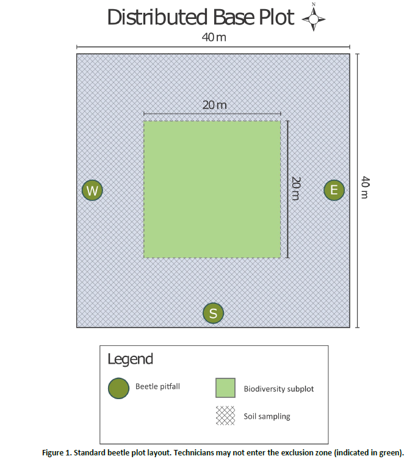

---
title: "EFI carabids data format, structure, and issues"
author: "EFI carabid challenge team"
date: "7/21/2020"
output: html_document
---


### NEON data product DP1.0022.001: [Ground beetles sampled from pitfall traps](https://data.neonscience.org/data-products/DP1.10022.001)

This is a brain dump with helpful information for understanding NEON's carabid data products, from experimental design to data structure


#### Experimental design  
* Since 2014 to 2017, 4 traps per plot, 10 plots per site, at all terrestrial sites, summed up to 40 traps per NEON site; each trap in a given plot oriented towards the one of the four cardinal directions.
* 2018 onward, the northward trap was eliminated from all plots across all NEON sites, resulted in 30 traps per site.      
* Collection frequency is biweekly (every 12-14th day within the sampling bout): Average `trappingDays` ~14

``` {r}
field_data <- bet_fielddata %>%
  dplyr::filter(sampleCollected == "Y") %>% #there's an entry for every trap, whether or not they got samples, only want ones with samples
  dplyr::select(sampleID, domainID, siteID, plotID, trapID, setDate, collectDate, eventID, trappingDays) %>%
  #eventID's are inconsistently separated by periods, so remove
  dplyr:: mutate(eventID = str_remove_all(eventID, "[.]")) %>%
  dplyr::mutate(trappingDays = interval(ymd(setDate), ymd(collectDate)) %/% days(1))

```

* ~~Maximum~~ An average of 11 collection bouts per year, although majority of the sites have 14 bouts per year.  
  * Burning or a storm/hurricanes can result in missing bouts within the season
  * Precise number of bouts per year vary in response to growing season length
    * fewest bout: Alaska Jun - Aug, 3 bouts
    * most bouts: Klemme Range Research Station, OK, Mar - Nov, 19 bouts
    * max of 13 bouts for tropical domains 4 & 20

* start and end dates within a year are determined on greenness and leaf senescence determined from MODIS data
    * 2013 to 2015: trapping began when 10-day running average low temperature was >4$^\circ$C and end when it was <4$^\circ$C. 

* Sampling season: increasing green-up (start date) and the mid-point between decreasing greenness and minimum greenness (end date). 
    * If sites experience two peak greens, the start date is based on the first cycle of greening and the end date is based on the second cycle. 
    * If temperature is unusually cold (<4$^\circ$C), then initial sampling can be delayed or stopped earlier than in previous years
    * No additional sampling will be carried out if the temperature remains higher than normal
* plots will usually stay the same at each site through time, though these are subject to change (e.g. at NIWO, plot 004 was switched for plot 013 in 2017)

##### Plot layout 
* this is the layout of a plot
        * 

#### sorting, filtering, and ID
* After collection, the samples are separated into carabids and bycatch (both vert and other invert) and subsequently, carabids samples are identified at multiple levels of expertise. 
* Sorted & IDed by field tech $\rightarrow$ subset of sorted  pinned (parataxonomist) and re-IDed $\rightarrow$ subset of pinned to expert taxonomists $\rightarrow$ subset to DNA bardocing
* Taxonomic expert's ID overrides identifications by the sorter and pinner.  
* Abundances are recorded by the sorting technician on the original sample and are not preserved across the different levels of ID. 
* For example, a sample of 200 individuals IDed as species A was sent to the pinner. Pinner IDs two new species (B and C) within that sample. Likewise, the     expert validates A, B, and C and adds two more species D and E. Neither expert nor parataxonomist record which individuals are B, C, D, and E. We have to     assume that only a single individual was identified for each of those new species, and the remaining individuals were correctly identified originally. 
    * abundance for species B, C, D, E = 1
    * $Abundance$ $of$ $species$ $A$ $=$ $Relative$ $abundance$ $documented$ $by$ $sorting$ $tech$ $-$ $No$ $of$ $new$ $species$ $IDed$ by $pinner$ $and$ $expert$
      *   $200 - (2+2)$

    
      *   
    Sample processing workflow. Source: NEON beetle User Guide

#### Data structure
* Data resolution
    * ID data is recorded at trap resolution
    * finest temporal resolution: `daysOfTrapping`, the range between `setDate` and `collectDate` per bout
* The data product splits into 9 dataframes  
    - 5 dataframes for data  
        * `bet_fielddata` - 75 day latency.  One record expected per sampleID for all of time
            * Each trap is collected once per bout, ergo, one record expected per `trapID` per `plotID` per `collectDate` in `bet_fielddata`. 
        * `bet_sorting` - 330 day latency. Sorting of the field-collected pitfall samples by sorting technicians.  One record expected per subsampleID for               all of time. One row per taxa per trapID per plotID per collectDate. Carabid subsamples may generate zero or more children in the                            bet_parataxonomistID table
        * `bet_parataxonomistID` - 330 day latency. Ground beetle pinning/pointing and identifications by parataxonomists.  one row per individual beetle                pinned. One record expected per individualID for all of time. The number of individualIDs pulled from a given subsampleID should not exceed the              individualCount given in the `bet_sorting` table.
        * `bet_archivepooling` - 330 day latency. one row per pooled archive vial (archiveID), which is a mixture of subsampleIDs. Not all subsampleID’s from             `bet_sorting` contribute to mixtures; some are pinned or maintained at the trap-level.  
        * `bet_expertTaxonomistIDProcessed` - 600 day latency. one row per individual beetle professionally identified. `scientificName` includes sub-species level identification. Better to create a new column concatenating `genus` and `specificEpithet` or exclude `infraspecificEpithet` from `scientificName`.    
        * A record from `bet_fielddata` may have zero (no samples collected) or multiple child records in `bet_sorting` if multiple taxa were found in the               same same (`sampleID`). A record from `bet_sorting` may have zero (no samples collected) or multiple child records in `bet_parataxonomistID` if              multiple individuals were selected for pinning from each `subsampleID`. A record in `bet_archivepooling` may have one or more records in                     `bet_sorting`, because multiple `subsampleIDs` may have been pooled into a single archiveVial. Each record in `bet_parataxonomistID` should have             zero or one corresponding records in `bet_expertTaxonomistIDProcessed`, depending on whether that `individualID` was selected for expert                     identification. Each record in `bet_parataxonomistID` may have zero or one corresponding records in `bet_expertTaxonomistIDRaw`. Since all beetles are sorted before pinning, the total number of beetles collected can be calculated as the sum of `individualCount` in `bet_sorting`.
            
    * 4 dataframes for metadata  
        * `categoricalCodes_10022` - spells out what each level for a categorical variable in a 'data' dataframe means  
        * `readme_10022`   
        * `validation_10022`   
        * `variables_10022` - super helpful, describes each variable in the 'data' dataframes   
* A sample is one collection at a trap
* The `trapID ` variable is contained in `bet_fielddata`, `bet_parataxonomistID`, and `bet_sorting`  
    * `bet_parataxonomistID`, and `bet_sorting` have NAs in trapID  
* The `uid` variable is unique to each dataframe - do not try joining dataframes by `uid`
* The `EventID` field indicates all samples in a bout for a site, and therefore corresponds to a single date during which the trap was set (`setDate`) and     collected (`collectDate`).  
    * A few sites have multiple `EventIDs` for different plots that were set and collected on the same day within the same site. 
*  
* Lots of useful information on data structure included in the User Guide pdf linked in the data product webpage  
* ID: if confident about the genus of a specimen and uncertain about the species level ID $\rightarrow$ ‘cf. species’ or ‘aff. species’ 
    * indicates that the identification provided in `scientificName` is possibly incorrect
    * Cryptic species: when two species that are morphologically indistinguishable, `scientificName` lists likely species pairs where the species epithet is          separated by `/`.
    * if `scientificName` contains `sp.` $\rightarrow$ all individuals of that group likely belong to a single species; `spp.` -> all individuals can belong         to multiple species, even multiple genera 
* `MorphoSpecies`: assigned by parataxonomists. Beetles morphologically similar, BUT, cannot assign a `scientificName`. 
    * `morphoSpecies` are split or merged after DNA barcoding or expert ID.
    * 

#### data quirks
* If all traps were not recovered from a given plot on the same day within a bout (the traps collected on the 12th day will be reset), the remaining traps        will be collected the following day BUT the traps will not be reset on the date of collection. The reset will be delayed until the start of the new bout      for the traps will delayed collection dates
* Sampling days/No of bouts across years for a site may not be uniform. 
    * if temperature drops <4$^\circ$C before the regular end of the sampling season, surveyscollection stops
    * if temperature remains <4$^\circ$C even after or at the regular initiation of trap collection, trapping is delayed until temperature >4$^\circ$C
* accuracy in species ID: 
    * Across all sites for all bouts/samples, per species, parataxonomist ID agree with that of experts >90% of the time. 
    * For most sites, the species ID agreement between parataxonomists vs experts is 100%
    * 100% incorrect ID is limited to a handful species recorded from a few sites
    * Temporal gaps in data/bouts
        * Traps not collected in 12-14 day interval: this is very uncommon; for the entire history of pitfall trap set-up, the missing data represents <1% of             the traps. This within-bout trap collection gaps mostly come from two domains.   
        * Domain 10: trapping can be truncated mid-season
        * Domain 12: if $\geq$ 5 instances of trap predation are observed within a single collection bout $\rightarrow$ site-wide temporary trap closures for two bouts (28              days)
        * Trap damage: this is slightly high: ~6% across all sites
* The IDs by parataxonomists have non-carabid taxa ergo `bet_parataxonomistID` contains non-carabid families incorrectly IDed as carabids although all non-carabids should have been sorted out as bycatch by sorting technicians; i.e., expert taxonomists have identified non-carabid families in `bet_expertTaxonomistIDProcessed`.
* Species-level match between parataxonomists and expert taxonomists: ~90%. Across all sites, for sample subset sent to experts, the parataxonomists have IDed over 90% of beetles correctly to the species level when matched with expert ID.
* 570+ species-level mismatches between experts and parataxonomists
* Only 430+ `morphospeciesID`s by parataxonomists. The number of beetles with a morphospecies ID is ~5% of the all beetles in `bet_parataxonomistID` dataset
* 99.98% of the traps were collected within 12-14 day window (a few traps were collected by later or earlier than 12-14 days); when `sampleCollected == "Y"` 


```{r} 
library(knitr)
kable(x = para_accuracy_domain, digits = 2, align = "r", caption = "Per domain accuracy for parataxonomist ID")
 ```
 
#### Table: Per domain accuracy for parataxonomist ID
| domainID|  100%| 90-100%| 80-90%| 0-80%|    0%|
|--------:|-----:|-------:|------:|-----:|-----:|
|      D01| 90.27|    0.05|   0.00|  0.75|  8.92|
|      D02| 96.98|    0.11|   0.00|  0.11|  2.79|
|      D03| 86.86|    0.00|   0.00|  0.79| 12.34|
|      D04| 13.46|    0.00|   0.00|  0.00| 86.54|
|      D05| 91.96|    0.00|   0.22|  0.98|  6.83|
|      D06| 69.18|    0.00|   0.51|  2.65| 27.65|
|      D07| 88.09|    0.06|   0.06|  1.58| 10.22|
|      D08| 74.69|    0.00|   0.14|  0.96| 24.21|
|      D09| 91.31|    0.00|   0.11|  0.56|  8.01|
|      D10| 96.47|    0.04|   0.07|  0.15|  3.27|
|      D11| 86.13|    0.00|   0.00|  0.62| 13.25|
|      D12| 55.38|    0.00|   0.00|  1.15| 43.46|
|      D13| 96.88|    0.00|   0.16|  0.31|  2.66|
|      D14| 92.66|    0.00|   0.00|  0.00|  7.34|
|      D15| 89.21|    0.00|   0.00|  0.00| 10.79|
|      D16| 93.45|    0.00|   0.00|  0.00|  6.55|
|      D17| 63.09|    0.00|   0.00|  0.32| 36.59|
|      D18| 75.89|    0.00|   0.00|  0.89| 23.21|
|      D19| 82.38|    0.00|   0.52|  1.04| 16.06|

* for all sites together, nearly 90% of the species-level IDs by parataxonomists matched the experts 


```{r} 
library(knitr)
kable(x = para_all_accu, format = "pipe", digits = 2, align = "r", caption = "Per domain accuracy for parataxonomist ID")
 ```

Table: Per domain accuracy for parataxonomist ID (percentage correctly IDed)

|   100% correct| 100-90| 90-80| 80<0|  zero|
|-----:|------:|-----:|----:|-----:|
| 88.88|   0.03|   0.1| 0.72| 10.27|


#### Data summary tables - How many beetles sent to experts are IDed to species level
    
taxonRank | count_taxonRank | `%`
----------| ----------------|---
family | 4 | 0.01
genus | 1433 | 3.43
order | 6 | 0.01
species | 35725 | 85.6 
speciesGroup | 17 | 0.04
subgenus | 194 | 0.46
subspecies | 4343 | 10.4 
 
* >95 are IDed to species level by experts


#### Misc
* There is also a [NEON data product for carabid DNA barcoding] (https://data.neonscience.org/data-products/DP1.10020.001), but that product is outside the     scope of this first forecasting challenge round.  
* trait data: length data is available 

#### Other data products/predictor variables/ co-variates
* [Soil and sediment data](https://www.neonscience.org/data-collection/soils-sediments) for the same plot where the traps are located
* [National Land-cover data 30 m resolution](https://www.usgs.gov/centers/eros/science/national-land-cover-database?qt-science_center_objects=0#qt-science_center_objects)
* [Terrestrial Plant data](https://www.neonscience.org/data-collection/terrestrial-plants) from the same plot
* [Other NEON data products](https://data.neonscience.org/data-products/explore)


